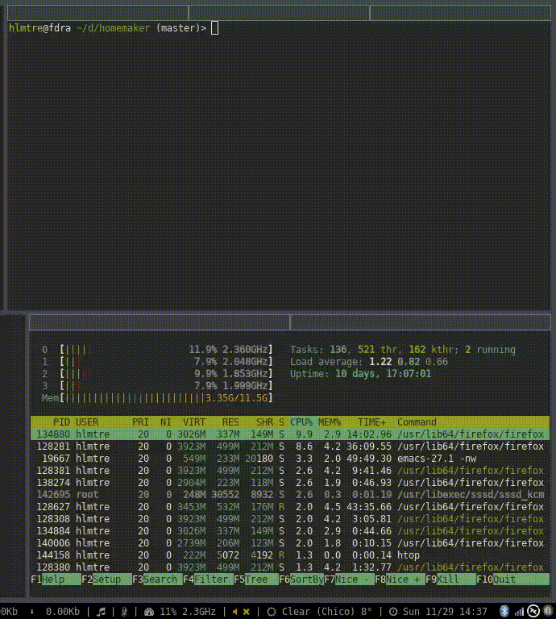
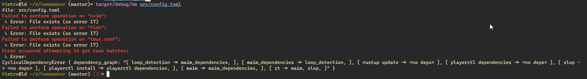

Have a dotfiles directory with all your stuff in it? Have homemaker put everything in its right place.

Check out the [changelog](changelog.md)
=====================================

**homemaker in action**



installation
============
* from crates.io: `cargo install hm`
* from github (may be in some state of flux): `cargo install --git https://github.com/hlmtre/homemaker`
* cloned locally: `cargo install --path .`

1. create a `config.toml` file either anywhere (and specify `-c` when you run `hm`) or in `~/.config/homemaker/`.
2. enter things to do things to in the file.
example:
```
## config.toml

[[obj]]
file = 'tmux.conf'
source = '~/dotfiles/.tmux.conf'
destination = '~/.tmux.conf'
method = 'symlink'

[[obj]]
task = 'zt'
solution = 'cd ~/dotfiles/zt && git pull'
dependencies = 'maim, slop'

[[obj]]
task = 'maim_dependencies'
solution = 'sudo apt install -y libxfixes-dev libglm-dev libxrandr-dev libglew-dev libegl1-mesa-dev libxcomposite-dev'

[[obj]]
task = 'maim'
source = '~/dotfiles/zt/maim'
solution = 'cd ~/dotfiles/zt/maim; make clean; cmake -DCMAKE_INSTALL_PREFIX="/usr" ./ && make && sudo make install'
method = 'execute'
dependencies = 'maim_dependencies'

[[obj]]
task = 'slop'
source = '~/dotfiles/zt/slop'
solution = 'cd ~/dotfiles/zt/slop; make clean; cmake -DCMAKE_INSTALL_PREFIX="/usr" ./ && make && sudo make install'
method = 'execute'

[[obj]]
task = 'slop'
source = '~/dotfiles/zt/slop'
solution = 'cd ~/dotfiles/zt/slop; make clean; cmake -DCMAKE_INSTALL_PREFIX="/usr" ./ && make && sudo make install'
method = 'execute'
```
3. `hm -c ~/path/to/your/config.toml`

why homemaker?
==============
* compared to say, gnu stow, homemaker supports more than just creating a mirrored symlinked filesystem.
* dependency resolution:
  * specify a set of tasks to complete, each with their own dependencies, and watch as it completes them in some
  order that satisfies each task's dependencies.
  * for example, in the sample `config.toml` (the one i use, actually), `maim` depends on having some graphics libraries installed.
  i created a task called `maim_dependencies`, and `hm` will complete `maim_dependencies` before attempting to complete `maim`.
  * `zt` has two dependencies: `maim` and `slop`. `hm` will complete the entire dependency tree below `zt` before atttempting `zt`.
  * `homemaker` complains if the dependency tree cannot be solved, and hopefully shows you a handy explanation why.
  
  * allows for specifying portions of the config to be executed (target tasks). only wanna run one task? `-t <taskname>`

homemaker unknowingly clobbers an existing dotfile manager written in Go some time ago. Linked [here](https://github.com/FooSoft/homemaker).
============================================================================================================================================

[](http://spacemacs.org)
and neovim.

Could not be made without [rust-analyzer](https://github.com/rust-analyzer/rust-analyzer).
