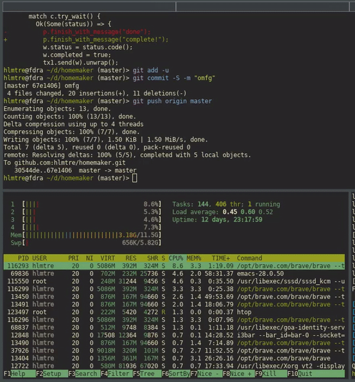

Have a dotfiles directory with all your stuff in it? Have homemaker put everything in its right place.


**homemaker in action**




1. create a config.toml file either anywhere or in ~/.config/homemaker/.
2. enter things to do things to in the file.
example:
```
## config.toml

[[obj]]
file = 'tmux.conf'
source = '~/dotfiles/.tmux.conf'
destination = '~/.tmux.conf'
method = 'symlink'

[[obj]]
task = 'zt'
solution = 'cd ~/dotfiles/zt && git pull'
dependencies = 'maim, slop'

[[obj]]
task = 'slop'
source = '~/dotfiles/zt/slop'
solution = 'cd ~/dotfiles/zt/slop; make clean; cmake -DCMAKE_INSTALL_PREFIX="/usr" ./ && make && sudo make install'
method = 'execute'
```
3. `hm ~/path/to/your/config.toml`

why homemaker?
==============
* compared to say, gnu stow, homemaker supports more than just creating a mirrored symlinked filesystem.
* dependency resolution:
  * specify a set of tasks to complete, each with their own dependencies, and watch as it completes them in some
  order that satisfies each tasks's dependencies.
  * for example, in the sample config.toml (the one i use, actually), `maim` depends on having some graphics libraries installed.
  i created a task called `maim_dependencies`, and `hm` will complete `maim_dependencies` before attempting to complete `maim`.

[](http://spacemacs.org)

thanks to actual good code:
serde
toml
symlink
solvent
indicatif
console
